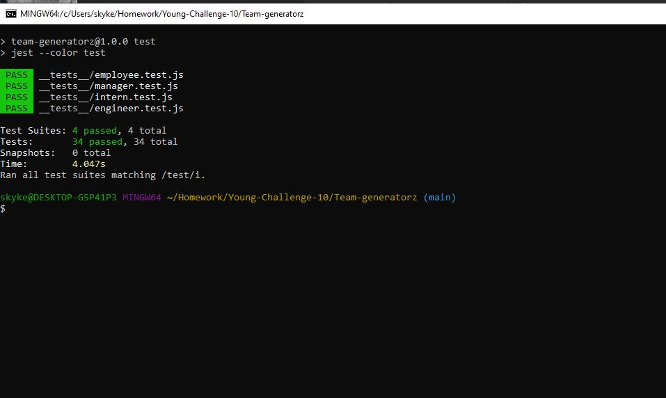

# Team Generatorz 🌟🌌
## This Project is a start from scratch format for Student to build a Node.js command-line application which takes in information and after a series of question, generates an HTML webpage that displays the employess on a software engineering team and detail summaries for each team member. For this application I wrote HTML, Javascript,apply CSS styling, bootstrap, nodes, json packages like inquirer and Jest. Four testing suites were also utilize confirmed to passed all test making this code maintainable. 
---
___
## Goal of this Project 
* Build a function Node.js command-line application following Object Oriented Programming concept. 
* During start of app, user are prompted to answer series of questions to build a team. 
* Utilize Json packages like Inquirer for prompting questionaire.
* Utilize Json packages like Jest to write testing suites for checking valid inputs. 
* Grab User input about creating a team and employees to generate a webpage that displays my team's basic info like emails, Github profiles.
* When clicked on the GitHub username then GitHub profile opens in a new tab. 
* Assign proper Classes and ID while applying Flexes , margin, padding  characteristics to improve aesthetics and looks.  
* Dynamically update HTML and CSS per user input. 
* Deployed Page to Github. 
> Most of the hour spend on this application were focused on setting up test and write Javascript to set up Index.Js for prompting questions, setting up each employees objects and export them. A good amount of work were put into setting up html templates as well as working on setting up HTML for styling, setup Codes. With the help on TAs a couple of time, my code became more polished and I was able to make it work function and maintainable. 
---
___
## Test Instructions
* create and setup package.json 
* create dependencies to includde "jest": "^your version"
* set script to run test on jest. 
* navigate to this app folder in gitbash/Terminal 
* RUN NPM I to install nodes packages. 
* RUN NPM TEST, this will start checking for passed or fail. 
---
___
# Project Content

## 🌟[Team-generatorz On Github](https://github.com/Young-Chhay/Team-generatorz "Github Page")

## 🌟 [Click me : Testing Demo on Google drive](https://drive.google.com/uc?id=1enFMM3Gw8vZ3vhtZR9kE8cLm5sIIewtC)

## 🌟 [Click me: Live Node.js command-line Demo on Google drive](https://drive.google.com/uc?id=1Z_UMVTGS2Z5vuqEoLvJ9EZCxqq_r3XEz)

---
___